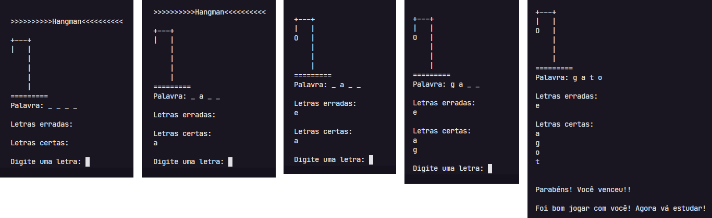
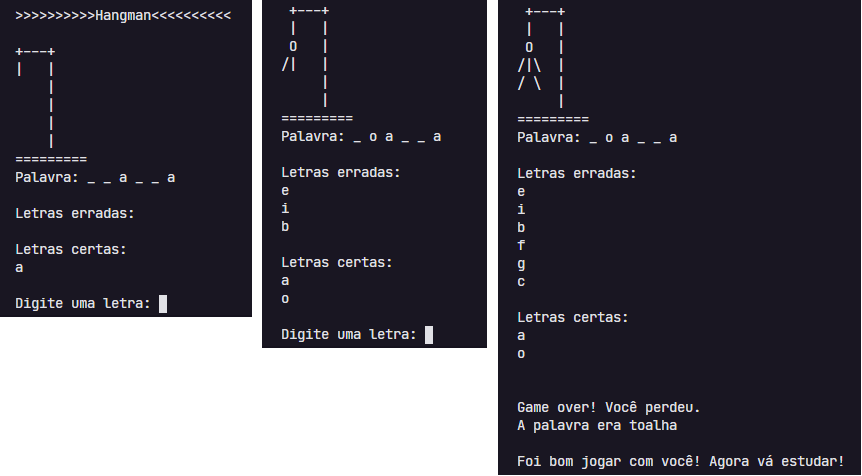

[](https://github.com/marioandre01)
[](#)
[](https://github.com/marioandre01/jogo_da_forca/stargazers)
[](https://github.com/marioandre01/jogo_da_forca/network/members)
[](https://github.com/marioandre01/jogo_da_forca/graphs/contributors)
[](https://github.com/marioandre01/jogo_da_forca/blob/master/LICENCE.md)


<h1 align="center">
    Jogo da forca - Em Python
</h1>

<p align="center"> 
  <a href="#-projeto">Projeto</a>&nbsp;&nbsp;&nbsp;|&nbsp;&nbsp;&nbsp;
  <a href="#-tecnologias">Tecnologias</a>&nbsp;&nbsp;&nbsp;|&nbsp;&nbsp;&nbsp;
  <a href="#-layout">Layout</a>&nbsp;&nbsp;&nbsp;|&nbsp;&nbsp;&nbsp;
  <a href="#bulb-funcionamento-da-aplicação">Funcionamento da aplicação</a>&nbsp;&nbsp;&nbsp;|&nbsp;&nbsp;&nbsp;
  <a href="#-executando-a-aplicação">Executando a aplicação</a>&nbsp;&nbsp;&nbsp;|&nbsp;&nbsp;&nbsp;
  <a href="#gear-contribuição">Contribuição</a>&nbsp;&nbsp;&nbsp;|&nbsp;&nbsp;&nbsp;
  <a href="#memo-licença">Licença</a>
</p>

## 💻 Projeto
Este projeto foi desenvolvido como desafio do curso online [Python Fundamentos para Análise de Dados](https://www.datascienceacademy.com.br/pages/curso-python-fundamentos-para-analise-de-dados) do site [Data Science Academy (DSA)](https://www.datascienceacademy.com.br/). O desáfio consiste em desenvolver o jogo da forca em modo texto, para ser jogado pelo terminal do sistema operacional. O objetivo do desáfio é avaliar se o aluno entendeu os conceitos da programação python e programação orientada a objetos - POO.

## 📋 Tecnologias

O projeto foi desenvolvido com as seguintes tecnologias:

- Python
- Programação orientada a objetos (POO)
- Random

## 🎨 Layout

<p align="center">
  
  
</p>

## :bulb: Funcionamento da aplicação


- Ao executar a aplicação será mostrado no terminal o seu layout. Nele é mostrado o dashboard da forca onde vai aparecer o corpo do boneco, e mais três campos. O primeiro campo chamado "Palavra", que representa a palavra oculta a ser descoberta. Nesse campo é mostrado o número de letras que ela tem, através do caracter underscore. O segundo campo chamado "Letras erradas" que vai conter as letras erradas digitadas pelo usuário e o terceiro campo chamado "Letras certas" que  vai conter as letras certas que a palavra contém digitadas pelo usuário. 
- Iniciado a aplicação é pedido para o usuário digitar uma letra. Caso a letra digitada esteja certa ela é revelada no campo "Palavra", isto é, no lugar do caractere underscore é mostrado a letra, e também é adicionada no campo "Palavras certas". Caso a letra não faça parte da palavra a ser descoberta, então uma parte do corpo do boneco é mostrado no dashboard da forca e a letra errada é mostrado no campo "Letras erradas". 
- Para acertar a palavra a ser descoberta o usuário tem seis tentativas, caso acerte a palavra nessas tentativas, ao final é revelado a palavra a ser descoberta e uma mensagem de parabéns é mostrada. Caso o usuário não acerte as seis tentativas o corpo do boneco é mostrado totalmente na forca, as letras erradas são mostradas no campo "Letras erradas" e uma mensagem de "Game Over" é mostrado ao usuário. 
- Toda vez que o usuário executar a aplicação, uma palavra é escolhida aleatoriamente no campo “Palavra”. Para pegar essas palavras é usado um arquivo.txt  chamado palavra.txt. Nesse processo o arquivo é lido pela aplicação, e uma das palavras que ele contém é sorteado para ser descoberta pelo usuário. Para a aplicação possuir novas palavras, é só adicionar elas nesse arquivo.


## 💻 Executando a aplicação

### Requisitos necessários

Para executar o projeto é necessário ter instalado em seu sistema:
- Python

### :octocat: Clonando o Repositório

```bash
$ git clone https://github.com/marioandre01/jogo_da_forca.git

# entre na pasta do projeto
$ cd jogo_da_forca
```
### 💻 Executando a aplicação

```bash

$ python forca_v1.py

```

## :gear: Contribuição

Para contribuir com esse projeto faça os seguintes passos:

- Faça um fork desse repositório.
- Crie uma branch com a sua feature: 
```bash
git checkout -b minha_feature
```
- Faça um commit das suas modificações: 
```bash
git commit -m 'feat: Minha nova feature'
```
- Faça um push para a sua branch: 
```bash
git push origin minha_feature
```

## :memo: Licença

Esse projeto está sob a licença MIT. Veja o arquivo [LICENSE](./LICENSE.md) para mais detalhes.


